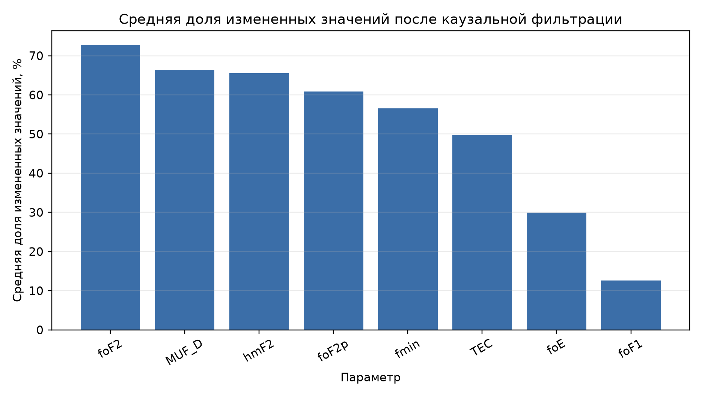
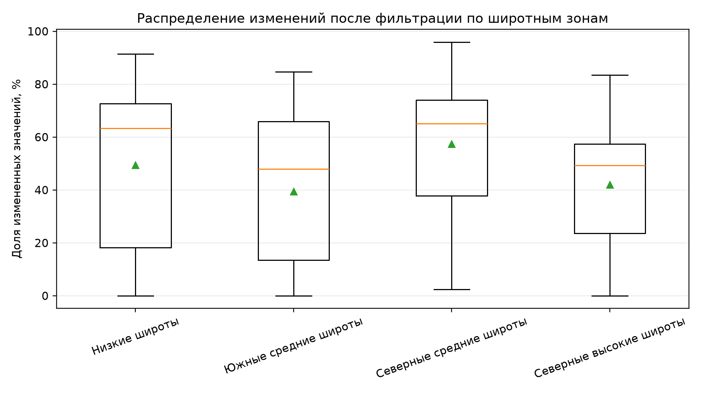
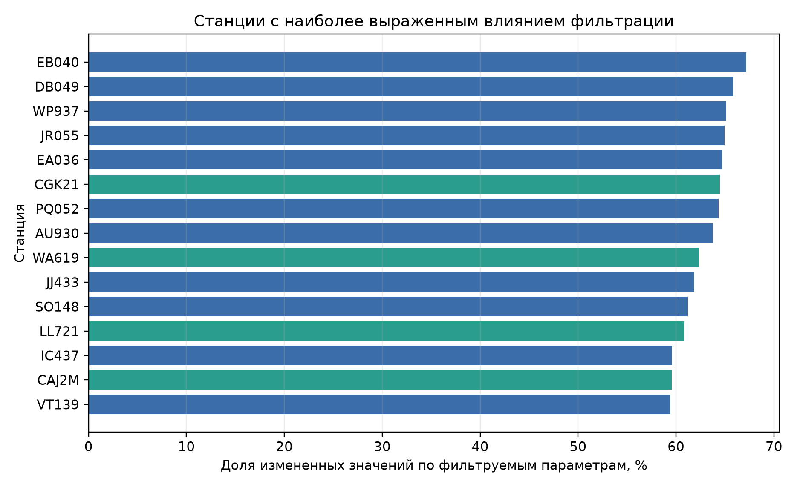
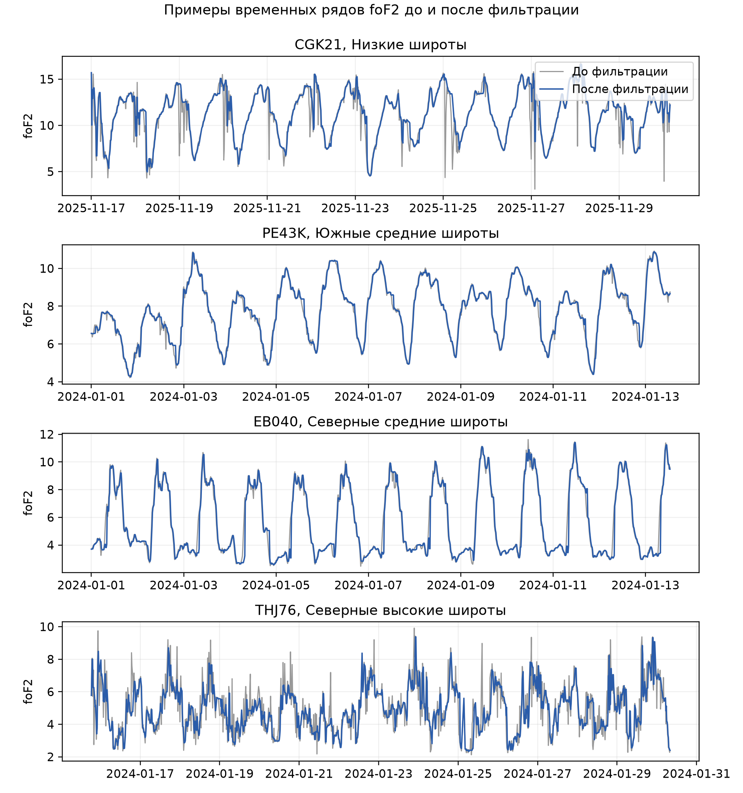

Результаты фильтрации временных рядов

Фильтрация выполнена для 41 ионосферной станции на регулярной 15-минутной временной сетке. В обработку включено 2 381 519 временных строк и 19 052 152 значений по восьми параметрам: foF2, foF1, foE, MUF_D, hmF2, TEC, fmin и foF2p. Процедура включала фильтр Хампеля и каузальное скользящее медианное сглаживание. Показатель измененных точек относится ко всей процедуре фильтрации, а не только к числу выбросов, найденных фильтром Хампеля.

Суммарно изменено 9 753 707 значений, что составляет 51,2% от общего числа обработанных значений. По отдельным параметрам получены следующие значения: foF2 - 1 738 017 измененных значений, или 72,7% в среднем по станциям; MUF_D - 1 600 938 значений, или 66,4%; hmF2 - 1 555 643 значения, или 65,6%; foF2p - 1 401 069 значений, или 60,8%; fmin - 1 358 783 значения, или 56,6%; TEC - 1 102 065 значений, или 49,7%; foE - 693 382 значения, или 29,9%; foF1 - 303 810 значений, или 12,6%.

На рисунке 1 приведено распределение доли измененных значений по параметрам. Максимальное значение получено для foF2 - 72,7%, минимальное для foF1 - 12,6%. Для параметров MUF_D, hmF2, foF2p и fmin доля изменений превышает 50%.

По широтным зонам получены следующие значения. В северных средних широтах обработана 21 станция, изменено 5 442 989 значений, средняя доля изменений составила 57,4%, медианная - 59,4%. В низких широтах обработано 12 станций, изменено 2 736 305 значений, средняя доля изменений составила 49,4%, медианная - 43,6%. В северных высоких широтах обработаны 3 станции, изменено 610 365 значений, средняя доля изменений составила 42,0%, медианная - 49,1%. В южных средних широтах обработаны 5 станций, изменено 964 048 значений, средняя доля изменений составила 39,5%, медианная - 40,4%.

На рисунке 2 приведено распределение доли измененных значений по широтным зонам. Среднее значение по северным средним широтам равно 57,4%, по низким широтам - 49,4%, по северным высоким широтам - 42,0%, по южным средним широтам - 39,5%.

Среди отдельных станций наибольшая доля измененных значений получена для EB040: 377 217 измененных значений из 70 176 временных строк, что соответствует 67,2% по восьми фильтруемым параметрам. Далее следуют DB049 - 369 791 значение, 65,9%; WP937 - 51 104 значения, 65,1%; JR055 - 364 583 значения, 64,9%; EA036 - 181 999 значений, 64,7%; CGK21 - 11 169 значений, 64,5%; PQ052 - 360 492 значения, 64,3%; AU930 - 64 149 значений, 63,8%; WA619 - 175 285 значений, 62,4%; JJ433 - 347 445 значений, 61,9%.

На рисунке 3 приведены 15 станций с наибольшей долей измененных значений. В первую десятку вошли EB040, DB049, WP937, JR055, EA036, CGK21, PQ052, AU930, WA619 и JJ433.

В разрезе "широтная зона - параметр" максимальные средние доли изменений составили: foF2p в северных средних широтах - 84,1%; foF2 в низких широтах - 78,0%; foF2 в южных средних широтах - 71,5%; TEC в северных высоких широтах - 56,4%. Для foF1 во всех широтных зонах доля изменений не превышала 20,4%.

На рисунке 4 приведены примеры временных рядов foF2 до и после фильтрации для станций из разных широтных зон. В приведенных фрагментах после фильтрации видны меньшие амплитуды одиночных отклонений относительно соседних точек.

При построении фильтрации использовались каузальные скользящие окна: значение в момент времени T рассчитывалось только по текущей и предыдущим точкам временного ряда. Будущие значения при расчете фильтрованного значения не использовались. Это условие необходимо для последующего сравнения прогнозных моделей на данных без фильтрации и после фильтрации.
